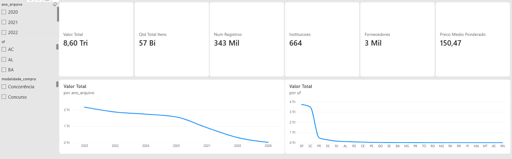
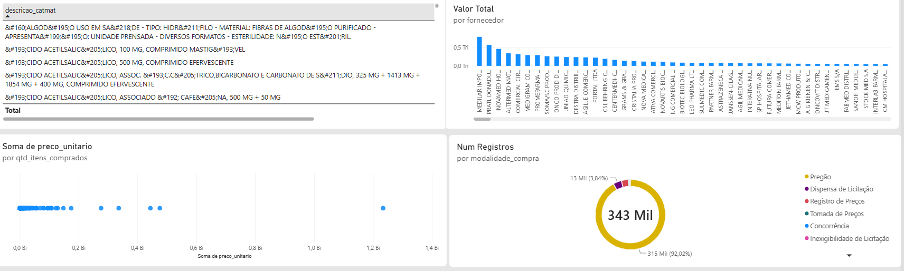

# Mini-Projeto Avaliativo — Módulo 2
# Visualização de Dados e Business Intelligence

**Aluno:** André Abranjo Ramos
**Turma:** Visualização de Dados e Business Intelligence [T2]
**Entrega:** Módulo 2 — Semana 07 | até 14/09/2026

---

## 1. Objetivo do Projeto

Desenvolver um dashboard analítico no Power BI para acompanhar
as compras de medicamentos e dispositivos médicos registradas no
**Banco de Preços em Saúde (BPS)** do Ministério da Saúde,
cobrindo o período de **2020 a 2026**.

O dashboard permite explorar:
- Evolução dos valores registrados ao longo do tempo
- Estados, municípios e instituições com maior volume financeiro
- Medicamentos e dispositivos mais adquiridos
- Fornecedores com maior participação nos registros
- Variação de preços unitários entre produtos, fornecedores e períodos
- Modalidades de compra mais utilizadas
- Oportunidades de investigação sobre diferenças relevantes de preços

---

## 2. Contextualização do Problema

A aquisição de medicamentos e dispositivos médicos pelo setor público
envolve grande volume financeiro, múltiplos fornecedores e diferentes
modalidades de compra. Sem uma visão analítica estruturada, é difícil
identificar variações de preço, avaliar a eficiência das compras e
apoiar decisões de gestão.

O BPS reúne registros públicos de compras realizadas por instituições
de saúde em todo o Brasil, tornando possível comparar preços praticados
por diferentes fornecedores, estados e períodos — informação estratégica
para gestores públicos e pesquisadores da área.

> ⚠️ A análise de diferenças de preços não deve ser interpretada
> automaticamente como comprovação de irregularidade. Variações podem
> estar relacionadas a fabricante, quantidade adquirida, localidade,
> modalidade de compra e características específicas da negociação.

---

## 3. Fonte dos Dados

| Item | Detalhe |
|------|---------|
| Base | Banco de Preços em Saúde — BPS |
| Órgão | Ministério da Saúde |
| Portal | https://dadosabertos.saude.gov.br/dataset/bps |
| Dicionário | https://dadosabertos.saude.gov.br/dataset/bps/resource/0e76f527-5e7e-417d-9d0b-f46d00afb717 |
| Período | 2020, 2021, 2022, 2023, 2024, 2025 e 2026 (até março) |
| Formato original | Arquivos `.csv` compactados em `.zip` por ano |
| Base consolidada | `BPS_20_26_AndreAbranjoRamos.csv` |
| Total de registros | 342.698 linhas |

---

## 4. Procedimentos para Download e Concatenação

### Download
1. Acesso ao portal: https://dadosabertos.saude.gov.br/dataset/bps
2. Download dos arquivos `.zip` referentes aos anos de 2020 a 2026
3. Arquivos salvos em `data/raw/`
4. Extração realizada via script Python com o módulo `zipfile`

> **Observação sobre 2026:** o arquivo disponível no portal cobre
> apenas o período de **janeiro a março de 2026**, refletindo os
> dados publicados até a data de coleta. Essa limitação está
> documentada na seção de Limitações.

### Concatenação
A consolidação foi realizada com o script `scripts/consolidar_bps.py`,
utilizando `pandas.concat` com `ignore_index=True` e `sort=False`
para preservar a estrutura original de cada base anual.

Uma coluna `ano_arquivo` foi adicionada a cada base antes da
concatenação, identificando o ano de origem de cada registro.

```python
df_total = pd.concat(dfs, ignore_index=True, sort=False)
```

### Comparação de estrutura entre bases
Antes da concatenação, foi executado o script `scripts/comparar_bases.py`,
que verificou:
- Nomes de colunas entre os 7 arquivos anuais
- Tipos de dados por campo
- Volume de registros por ano
- Percentual de nulos em campos críticos
- Valores únicos em campos categóricos (UF, modalidade)

**Resultado:** nenhuma discrepância de nomes ou estrutura foi
identificada entre os anos. As bases são estruturalmente idênticas
e foram concatenadas sem necessidade de renomeação de colunas.

---

## 5. Tratamentos e Transformações Realizados

### Via Python (`scripts/consolidar_bps.py`)

| Tratamento | Decisão |
|------------|---------|
| Encoding | Leitura testada em `utf-8`, `latin-1`, `cp1252` e `utf-8-sig` |
| Nomes de colunas | Padronizados: minúsculo, sem acento, sem espaço, sem caracteres especiais |
| Campos numéricos | Separador decimal convertido de vírgula para ponto; separador de milhar removido |
| Campos de data | Convertidos para `datetime` com `dayfirst=True` |
| Duplicatas | Verificadas e removidas com `drop_duplicates()` |
| Coluna auxiliar | `ano_arquivo` adicionada para identificar o ano de origem |

### Via Power Query (Power BI)

| Tratamento | Decisão |
|------------|---------|
| Tipos de coluna | Revisados e corrigidos no editor do Power Query |
| `preco_total` | Tipo: Número decimal |
| `quantidade` | Tipo: Número inteiro |
| `data_compra` | Tipo: Data |
| `ano_arquivo` | Tipo: Texto |
| Filtro de qualidade | Registros com `preco_total` nulo ou zero foram excluídos da análise |

---

## 6. Principais Colunas Utilizadas

| Coluna | Descrição |
|--------|-----------|
| `preco_total` | Valor total da compra registrada |
| `preco_unitario` | Preço por unidade do item adquirido |
| `quantidade` | Quantidade de itens adquiridos |
| `descricao_produto` | Nome do medicamento ou dispositivo médico |
| `nome_fantasia_fornecedor` | Nome do fornecedor do produto |
| `nome_instituicao` | Nome da instituição compradora |
| `uf` | Unidade federativa da instituição compradora |
| `municipio` | Município da instituição compradora |
| `modalidade_compra` | Modalidade de licitação ou contratação utilizada |
| `data_compra` | Data do registro da compra |
| `ano_arquivo` | Ano de origem do arquivo (coluna auxiliar criada) |

---

## 7. KPIs e Métricas Definidas

| KPI | Definição | Fórmula DAX |
|-----|-----------|-------------|
| Valor Total Registrado | Soma do valor total de todas as compras nos filtros aplicados | `SUM(BPS_Consolidado[preco_total])` |
| Quantidade Total de Itens | Soma das quantidades adquiridas | `SUM(BPS_Consolidado[quantidade])` |
| Número de Registros | Contagem de linhas na base filtrada | `COUNTROWS(BPS_Consolidado)` |
| Instituições Compradoras | Contagem distinta de instituições | `DISTINCTCOUNT(BPS_Consolidado[nome_instituicao])` |
| Fornecedores | Contagem distinta de fornecedores | `DISTINCTCOUNT(BPS_Consolidado[nome_fantasia_fornecedor])` |
| Preço Unitário Médio Ponderado | Relação entre valor total e quantidade total | `DIVIDE(SUM([preco_total]), SUM([quantidade]), 0)` |

> O Preço Unitário Médio Ponderado deve ser interpretado com cautela
> quando os filtros incluírem produtos diferentes, unidades de
> fornecimento distintas ou apresentações variadas.

---

## 8. Dashboard

O dashboard foi desenvolvido no **Power BI Desktop** e está
disponível no repositório em três formatos:

- Arquivo `.pbix`: `dashboard/BPS_Dashboard_AndreAbranjoRamos.pbix`
- Capturas de tela: `dashboard/prints/`

### Página 1 — Visão Geral


### Página 2 — Produtos e Fornecedores


### Página 3 — Análise de Preços


---

## 9. Principais Análises e Descobertas

### Volume Financeiro por Estado
Os três estados com maior volume financeiro registrado foram,
nesta ordem: **São Paulo (SP), Santa Catarina (SC) e Paraná (PR)**.
SP lidera com folga, refletindo seu maior número de instituições
de saúde e volume populacional. A presença de SC em segundo lugar
— à frente de estados maiores como RJ e MG — é um ponto de
atenção que merece investigação adicional sobre o perfil das
instituições compradoras catarinenses.

### Produtos com Maior Destaque
Os três produtos com maior relevância na base foram:
1. **Carbamazepina** — medicamento anticonvulsivante de uso contínuo,
   com alto volume de compras recorrentes
2. **Sertralina Cloridrato** — antidepressivo com demanda crescente,
   especialmente após 2020
3. **Salbutamol** — broncodilatador amplamente utilizado em
   tratamentos respiratórios

Os três são medicamentos de uso contínuo e de alto consumo pelo
SUS, o que explica sua presença no topo da base.

### Variação de Preços entre Fornecedores
A análise de preços unitários entre fornecedores revelou um padrão
relevante: **fornecedores do Rio Grande do Sul praticam preços
menores associados a maiores quantidades adquiridas**, enquanto
**fornecedores de São Paulo apresentam alguns dos maiores valores
unitários registrados**.

Esse comportamento é consistente com a lógica de escala —
compras em maior volume tendem a resultar em preços unitários
menores. Porém, a diferença geográfica também pode refletir
diferenças no perfil das instituições compradoras, nas
modalidades de licitação utilizadas e nas apresentações
dos produtos adquiridos.

### Evolução Temporal
A base cobre 2020 a março de 2026. É possível observar a
evolução anual dos valores registrados, permitindo identificar
tendências de crescimento ou redução nos gastos com medicamentos
e dispositivos médicos ao longo do período.

---

## 10. Recomendações Baseadas nos Dados

1. **Investigar o volume de SC:** Santa Catarina em segundo lugar
   nacional merece análise mais aprofundada — quais instituições
   concentram esse volume e quais produtos estão envolvidos.

2. **Ampliar compras coletivas para reduzir preço unitário:**
   o padrão observado no RS demonstra que volumes maiores resultam
   em preços menores. Consórcios de compra entre municípios podem
   replicar esse ganho em outros estados.

3. **Monitorar preços de Carbamazepina, Sertralina e Salbutamol:**
   por serem os produtos de maior volume e uso contínuo, variações
   de preço nesses itens têm impacto financeiro relevante no
   orçamento público de saúde.

4. **Criar alertas para variações de preço acima de um limiar:**
   a análise mostrou diferenças expressivas entre fornecedores
   para o mesmo produto. Um processo de monitoramento contínuo
   com alertas automáticos poderia apoiar compras mais eficientes.

5. **Padronizar modalidades de compra:** a diversidade de
   modalidades na base dificulta comparações diretas. A
   padronização dos registros na origem melhoraria a qualidade
   das análises futuras.

---

## 11. Limitações Identificadas

| Limitação | Impacto |
|-----------|---------|
| 2026 cobre apenas janeiro a março | Análise anual de 2026 incompleta — não comparável aos anos anteriores |
| Variações de preço têm múltiplas causas | Diferenças não indicam necessariamente irregularidade |
| Preço unitário médio ponderado mistura produtos diferentes | Deve ser usado com filtros específicos por produto |
| Base não contém dados de qualidade ou eficácia | Análise limitada à dimensão financeira e quantitativa |
| Ausência de identificador único de compra | Duplicatas não podem ser confirmadas com certeza absoluta |

---

## 12. Instruções para Reprodução do Projeto

### Pré-requisitos
- Python 3.8 ou superior
- Bibliotecas: `pandas`, `glob`, `zipfile` (nativas ou via pip)
- Power BI Desktop (gratuito em powerbi.microsoft.com/downloads)

### Passo a passo

```bash
# 1. Clone o repositório
git clone https://github.com/Andre-Abranjo-Ramos/turma-visualizacao-dados-t2-modulo02-Andre-Abranjo-Ramos.git

# 2. Entre na pasta
cd turma-visualizacao-dados-t2-modulo02-Andre-Abranjo-Ramos

# 3. Instale as dependências Python
pip install pandas

# 4. Coloque os arquivos ZIP do BPS em data/raw/

# 5. Execute o script de comparação das bases
python scripts/comparar_bases.py

# 6. Execute o script de consolidação
python scripts/consolidar_bps.py

# 7. Abra o dashboard no Power BI Desktop
# Arquivo: dashboard/BPS_Dashboard_AndreAbranjoRamos.pbix
# Se necessário, atualize o caminho da fonte de dados para
# data/processed/BPS_20_26_AndreAbranjoRamos.csv
```

---

## Estrutura do Repositório

```
turma-visualizacao-dados-t2-modulo02-Andre-Abranjo-Ramos/
│
├── data/
│   ├── raw/                          ← ZIPs e CSVs anuais originais
│   └── processed/
│       └── BPS_20_26_AndreAbranjoRamos.csv
│
├── scripts/
│   ├── consolidar_bps.py             ← concatenação das bases
│   └── comparar_bases.py             ← comparação estrutural
│
├── dashboard/
│   ├── BPS_Dashboard_AndreAbranjoRamos.pbix
│   └── prints/
│       ├── pagina1_visao_geral.png
│       ├── pagina2_produtos_fornecedores.png
│       └── pagina3_analise_precos.png
│
├── video/
│   └── link.txt                      ← link do vídeo de apresentação
│
└── README.md
```

---

## Links do Projeto

- 🔗 **Repositório GitHub:** https://github.com/Andre-Abranjo-Ramos/turma-visualizacao-dados-t2-modulo02-Andre-Abranjo-Ramos
- 🎥 **Vídeo de apresentação:** *(depois vou disponibilizar o link)*
